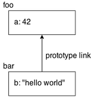
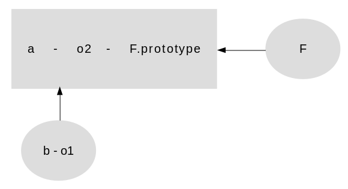

## Book 1

##### Functions:

```javascript
function foo() { .. }
```

\- `foo` is just a variable in the outer enclosing scope that's given a reference to the function being declared. 

\- The function itself is a value, just like 42 or [1,2,3] would be.

<br />

##### Immediately Invoked Function Expressions `IIFEs`:

```javascript
(function IIFE(){ .. })();
```

\- The first enclosing `( )` pair makes the function an expression.

\- The final `()`  is what actually executes the function expression.

> `IIFE` is often used to declare variables that won't affect the surrounding code outside the `IIFE`.

<br />

##### Closure:

A way to "remember" and continue to access a function's scope (its variables) even once the function has finished running.

```javascript
function makeAdder(x) {
	// inner function `add()` uses `x`, so it has a "closure" over it
  function add(y) {
   	return x + y;
  };
  return add;
}

var plusOne = makeAdder(1);
var plusTen = makeAdder(10);

plusOne(3);    //  1 + 3
plusTen(13);   //  10 + 13
```

<br />

##### Module pattern:

\- The most common usage of closure in JavaScript is the module pattern which let us:

- define private implementation details (variables, functions) that are hidden from the outside world.
- public `API` that is accessible from the outside.

```javascript
function User() {
	var username, password;
  function doLogin(user,pw) {
    username = user;
    password = pw;
  }
  var publicAPI = {
    login: doLogin
  };
  return publicAPI;
}
// create a `User` module instance
var fred = User();
fred.login( "fred", "12Battery34!" );
```

<br />

##### 'This' identifier:

\- `this` reference points to an object. But which one, it depends on how the function was called.

\- `this` does not refer to the function itself.

```javascript
function foo() {
	console.log( this.bar );
}

var bar = "global";
var obj1 = {
	bar: "obj1",
	foo: foo
};
var obj2 = {
	bar: "obj2"
};

foo();		// "global"
obj1.foo();	// "obj1"
foo.call(obj2);	// "obj2"
new foo();	// undefined
```

###### \- Four rules:

- depending on the mode:
  - In strict mode: `this` would be undefined.
  - In non-strict mode: `foo()` ends up setting `this` to the global object. 
- `obj1.foo()` sets this to the `obj1` object.
- `foo.call(obj2)` sets this to the `obj2` object.
- new `foo()` sets this to a brand new empty object.

<br />

##### Prototypes:

When we reference a property on an object, if that property doesn't exist,  JavaScript will automatically use that object's internal prototype reference to find another object to look for the property on. 

\- We could think of this almost as a fallback if the property is missing.

```javascript
var foo = {
  a: 42
};

var bar = Object.create( foo );
bar.b = "hello world";

bar.b;    // "hello world"
bar.a;    // 42 <-- delegated to `foo`
```

.

<br />

------

## Book 2

### Ch-1: Scope

\- a chunk of source code, will undergo typically three steps before it is executed, `compilation`:

- Tokenizing/Lexing:  `var a = 2;` would likely be broken up into tokens >>>  `var`, `a`, `=`, `2`, `;` 
- Parsing: taking a stream (array) of tokens and  turning it into a tree of nested elements `AST` (**A**bstract **S**yntax **T**ree).
- Code-Generation: the process of taking an `AST` and  turning it into executable code. 

<br />

**scope**: 

\- The set of rules that determines where and how the *Engine* can look up a variable by its identifier name.

\- This look-up may be for the purposes of 

- assigning to the variable, which is an `LHS` (source) reference.
- retrieving its value, which is an `RHS` (target) reference.

\- The *Engine* compiles code before it executes, it splits up statements like `var a = 2;` into:

- `var a` to declare it in that *Scope*. This is performed at the beginning, before code execution.
- `a = 2` to look up the variable (`LHS` reference) and assign to it if found.

> `LHS` and `RHS` reference look-ups start at the currently executing *Scope*, and if they don't find what they're looking for there, they work their way up the nested *Scope*, one scope at a time, until they get to the global and stop, and either find it, or don't.

- Unfulfilled `RHS` references result in `ReferenceError`s being thrown. 
- Unfulfilled `LHS` references result in:
  - if not in Strict Mode: an automatic, implicitly-created global of that name.
  - if in "Strict Mode": `ReferenceError`.

<br />

------

### Ch-2: Lexical Scope

\- There are two predominant models for how scope works:

- **Lexical Scope**:  used by the vast majority of programming languages.
- **Dynamic Scope**:  used by some languages (such as Bash scripting, some modes in Perl, etc.) 

**Lexical scope**: 

\- scope is defined by author-time decisions of where functions are declared. 

\- The same identifier name can be specified at multiple layers of nested scope, which is called `shadowing`.

> the inner identifier `shadows` the outer identifier.

\- Global variables are automatically properties of the global object (`window` in browsers, etc..).

**Cheating Lexical**: using `eval("var b = 3;")` OR `with (obj){...}` >> Don't use them.

> Lexical scope cares *where a function was declared*, but dynamic scope cares where a function was *called from*.

<br />

------

### Ch-3: Block Scope

\- hide variables and functions by enclosing them in the scope of a function.

\- you should expose only what is minimally necessary, and "hide" everything else.

```javascript
function doSomething(a) {
	function doSomethingElse(a) {
		return a - 1;
	}
	var b = a + doSomethingElse( a * 2 );
	console.log( b * 3 );
}

doSomething( 2 ); // 15
```

\- `b` and `doSomethingElse(..)` are not accessible to any outside influence,(controlled only by `doSomething()`. 

<br />

##### Expression  `(function foo(){ .. })`:

\- the identifier `foo` is found *only* in the scope where the `..` indicates.

<br />

##### Anonymous 'anonymous function expression':

```javascript
setTimeout( function(){
	console.log("I waited 1 second!");
}, 1000 );
```

<br />

##### Inline function expressions:

```javascript
setTimeout(function timeoutHandler(){ // <-- Look, I have a name!
	console.log( "I waited 1 second!" );
}, 1000 );
```

<br />

##### var - let - const:

\- `var` is global scope (hoist-able) variable.

\- `let` and `const` is block scope.

> Declarations made with `let` will *not* hoist to the entire scope of the block they appear in. 

<br />

##### Using explicit blocks:

```javascript
function process(data) {
	// do something interesting
}

// anything declared inside this block can go away after!
{
	let someReallyBigData = { .. };

	process( someReallyBigData );
}

var btn = document.getElementById( "my_button" );

btn.addEventListener( "click", function click(evt){
	console.log("button clicked");
}, /*capturingPhase=*/false );
```

> Declaring explicit blocks for variables is a powerful tool that you can add to your code toolbox.

<br />

------

### Ch-4: Hoisting

\- When we see `var a = 2;`,  JavaScript actually thinks of it as two statements:

- the declaration `var a;` is processed during the compilation phase
- the assignment `a = 2;` is left **in place** for the execution phase.

> All declarations are processed first, before any part of the code is executed.

\- Variable and function declarations are "moved" from where they appear in the flow of the code to the top of the code. 

\- This gives rise to the name **Hoisting**.

\- Function declarations are hoisted, But function expressions are not.

```javascript
foo(); // not ReferenceError, but TypeError!
var foo = function bar() {};
```

- The variable identifier `foo` is hoisted and attached to the global scope.
- `foo` has no value yet and is attempting to invoke the `undefined` value, which is a `TypeError`.

> Functions are hoisted first, and then variables.

<br />

------

### Ch-5: Scope Closure

**Closure**:

\- lets the function continue to access the lexical scope it was defined in at author-time.

```javascript
for (var i=1; i<=5; i++) {
	setTimeout( function timer(){
		console.log( i );
	}, i*1000 );
}
// output: 6..6..6..6..6
```

\- all 5 `timer()` functions are closed over the same shared global scope, which has only one `i` in it.

\- we need a new closured scope for each iteration of the loop.

```javascript
for (var i=1; i<=5; i++) {
	(function(){
		var j = i;
		setTimeout( function timer(){
			console.log( j );
		}, j*1000 );
	})();
}
// =========== better ===========
for (var i=1; i<=5; i++) {
	(function(j){
		setTimeout( function timer(){
			console.log( j );
		}, j*1000 );
	})( i );
}
// =========== better ===========
for (var i=1; i<=5; i++) {
	let j = i; // `let` turns a block into a scope that we can close over
	setTimeout( function timer(){
		console.log( j );
	}, j*1000 );
}
// =========== better ===========
for (let i=1; i<=5; i++) {
	setTimeout( function timer(){
		console.log( i );
	}, i*1000 );
}
```

<br />

##### modules:

```javascript
function CoolModule() {
	var something = "cool";
	var another = [1, 2, 3];

	function doSomething() {
		console.log( something );
	}
	function doAnother() {
		console.log( another.join( " ! " ) );
	}

	return {
		doSomething: doSomething,
		doAnother: doAnother
	};
}

var foo = CoolModule();
foo.doSomething(); // cool
foo.doAnother(); // 1 ! 2 ! 3
```

<br />

##### Appendix => `Apply` vs `Call` vs `Bind`:

```js
let person = {name: 'Aly'};

function say(greeting) {
    console.log(greeting + ' ' + this.name);
}
```

\- `Call` invokes the function and allows you to pass in arguments one by one.

```js
say.call(person, 'Hello');
```

\- `Apply` invokes the function and allows you to pass in arguments as an array.

```js
say.apply(person, ['Hello']);
```

\- `Bind` returns a new function, allowing you to pass in a this array and any number of arguments.

```js
let sayHello = say.bind(person, 'hello');
sayHello();
```

<br />

------

## Book 3

### Ch-1: this

```javascript
function foo(num) {
	console.log(num);
	this.count++;
}
foo.count = 0;

for (let i=6; i<10; i++) { foo(i); }
console.log(foo.count); // 0 -- WTF?
```

\- `this.count++;` created a global variable `count`, and it currently has the value `NaN`.

\- Fix it by:

```javascript
// reference a function object from inside itself
function foo() {
  foo.count = (typeof foo.count === 'undefined') ? foo.count = 0 : foo.count + 1;
  return foo.count;
}

// using `this` to point at the `foo` function object
function foo(num) {
	this.count++;
}
foo.call(foo, i);
```

> `this` is not an author-time binding but a runtime binding.

<br />

------

### Ch-2: `this` All Makes Sense Now!

**Call-site**: the location in code where a function is called.

**Call-stack**: the stack of functions that have been called to get us to the current moment in execution.

\- The call-site is in the invocation before the currently executing function.

```js
function baz() {
    // call-stack is: `baz`        								
  	// so our call-site is in the global scope
    console.log( "baz" );
    bar(); // <-- call-site for `bar`
}

function bar() {
    // call-stack is: `baz` -> `bar`   						
  	// so, our call-site is in `baz`
    console.log( "bar" );
    foo(); // <-- call-site for `foo`
}

function foo() {
    // call-stack is: `baz` -> `bar` -> `foo`			
  	// so, our call-site is in `bar`
    console.log( "foo" );
}

baz(); // <-- call-site for `baz`
```

> We must inspect the call-site to know what `this` references to.

<br />

##### Context vs Scope:

\- Context of a function is the value of `this` for that function.

\- Scope defines the way JavaScript resolves a variable at run time.

<br />

##### Determining the `this` binding:

\- we should apply this four rules to the call-site, in *this* order of precedence:

###### 1- Called with `new`?

\- When a function is invoked with `new` in front of it, the following things are done automatically:

- a brand new object is created (aka, constructed).
- the newly constructed object is [[Prototype]]-linked.
- the newly constructed object is set as the `this` binding for that function call.
- the new-invoked function call will automatically return the newly constructed object. 
  - this will happen only the function doesn't return its own alternate object.

<br />

###### 2- Explicit Binding:

\- Called with `call` or `apply` (or `bind`)? Use the specified object.

<br />

###### 3- Implicit Binding:

\- we could say that the `obj` object "contains" the function reference at the time the function is called.

\- Only the top/last level of an object property reference chain matters to the call-site.

```js
function foo() {
	console.log( this.a );
}
var obj2 = {
	a: 42,
	foo: foo
};
var obj1 = {
	a: 2,
	obj2: obj2
};

obj1.obj2.foo(); // 42
```

\- fear when an implicitly bound function loses that binding.

```js
function foo() {
	console.log( this.a );
}

var obj = {
	a: 2,
	foo: foo
};

var bar = obj.foo; // function reference/alias!
var a = "oops, global"; // `a` also property on global object

bar(); // "oops, global"
```

> the call-site is what matters, and the call-site is bar(), which is a plain and thus the default binding applies.

<br />

###### 4- Default:

```js
// ======= undefined in 'strict mode' =======
function foo() {
	"use strict";
	console.log( this.a );
}
var a = 2;
foo(); // TypeError: `this` is `undefined`
// ======== global object otherwise ========
function foo() {
	console.log( this.a );
}
var a = 2;
foo(); // 2

```

> \- Variables declared in the global scope are synonymous with global-object properties of the same name. 
>
> \- They're not copies of each other, they *are* each other. Think of it as two sides of the same coin.

<br />

##### Arrow functions:

\- adopt the `this` binding from the enclosing (function or global) scope.

\- The most common use-case will likely be in the use of callbacks.

```js
function foo() {
	setTimeout(() => {
		// `this` here is lexically adopted from `foo()`
		console.log( this.a );
	},100);
}
```

<br />

------

### Ch-3: Objects

\- Objects come in two forms:

```js
// ===== The declarative (literal) form =====
var myObj = {
	key: value
	// ...
};
// ===== The constructed form uncommon =====
var myObj = new Object();
myObj.key = value;
```

\- the simple primitives (`string`, `number`, `boolean`, `null`, `undefined`) are **not** themselves `objects`.

\- The primitive value `"I am a string"` is not an object, it's a primitive literal and immutable value.

- To perform operations on it, such as checking its length `String` object is required.

\- `function` is a sub-type of object (technically, a "callable object").

\- There are several object sub-types, usually referred to as **built-in objects**.

- **[`String` `Number` `Boolean` `Object` `Function` `Array` `Date` `RegExp` `Error`]**.

> `JS` automatically coerces a `"string"` primitive to a `String` object when necessary.

<br />

##### Contents

\- To access the value at the location `a` in `myObject`, we need to use:

- The `.a` syntax: usually referred to as "property" access >> 
  - requires an Identifier.
- The `["a"]` syntax: usually referred to as "key" access
  - can take `UTF-8/unicode string` as the name for the property.

\- Computed Property Names:

- with `ES6` - `myObject[prefix + name]`:

  ```js
  var myObject = {
  	[prefix + "bar"]: "hello",
  	[prefix + "baz"]: "world"
  };
  ```

\- You could use an array as a plain key/value object `myArray.baz = "baz";`.

<br />

##### Duplicating Objects:

\- complicated because it's not fully clear what, by default, should be the algorithm for the duplication.

- *shallow* copy:  `Object.assign({}, myObject);`

- *deep* copy:  JSON-safe object: 

  ```js
  JSON.parse( JSON.stringify(obj) );
  ```

<br />

##### Property Descriptors:

\- as of `ES5`, all properties are described in terms of a **property descriptor**.

\- Ex: object property `a` is much more than just its `value` of `2`.

```js
var myObject = {};

Object.defineProperty(myObject, "a", {
	value: 2,
	writable: true,
	configurable: true,
	enumerable: true
});

myObject.a; // 2
```

\- It includes 3 other characteristics: 

- **Writable**: The ability to change the value of a property.
- **Configurable**: As long as a property is currently configurable, we can modify its descriptor definition, using the same `defineProperty(..)` utility.
- **Enumerable**: 
  - controls if a property will show up in certain object-property enumerations such as the `for..in` loop.
  - All normal user-defined properties are defaulted to `enumerable`.

> By combining `writable:false` and `configurable:false`, you can essentially create a **constant**.

<br />

\- `Object.preventExtensions(..)` to prevent an object from having new properties added to it.

<br />

##### Seal `Object.seal(..)`

\-  creates a "sealed" object:

- takes an existing object and essentially calls `Object.preventExtensions(..)` on it.
- marks all its existing properties as `configurable:false`.

<br />

##### Freeze `Object.freeze(..)`

\-  creates a frozen object: 

- takes an existing object and essentially calls `Object.seal(..)` on it.
- marks all "data accessor" properties as `writable:false`.

<br />

\- The default `[[Put]]` and `[[Get]]` operations for objects can be overridden in `ES5`:

```js
var myObject = {
	get a() {	return this._a_;  },			// define a getter for `a` 
	set a(val) { this._a_ = val + 1; }	// define a setter for `a`
};

Object.defineProperty(
	myObject,	// target
	"b",			// property name
	{					// descriptor
		get: function(){ return this.a * 2 },
		enumerable: true
	}
);

myObject.a = 2; 	// myObject._a_ = 3

myObject.a;				// 3
myObject.b; 			// 6
```

<br />

##### Existence:

\- The `in` operator checks for the existence of a property name. 

```js
// see in the obj, or at any higher level of the [Prototype] chain object traversal.
("a" in obj);
// see if only obj has the property or not.
obj.hasOwnProperty( "a" );	// true

4 in [2, 4, 6] // false
0 in [2, 4, 6] // true.
```

<br />

##### Enumeration:

```js
var myObject = { };

Object.defineProperty(
	myObject,
	"a",
	{ enumerable: true, value: 2 }		// make `a` enumerable, as normal
);

Object.defineProperty(
	myObject,
	"b",
	{ enumerable: false, value: 3 }		// make `b` NON-enumerable
);

for (var k in myObject) {
	console.log( k, myObject[k] );
}
// "a" 2
```

> the order of iteration over an object's properties may vary between different `JS` engines.

```js
Object.keys(obj); 								// returns an array of all enumerable properties.
Object.getOwnPropertyNames(obj); 	// returns an array of all properties.
```

<br />

##### Iteration:

\- `forEach()`,`every()`, `some()`,`filter()`,`map` accepts a callback to apply to each element in the array.

- `forEach`: iterate over all values in the array

- `every`:  keeps going until the end *or* the callback returns a **false**.

- `some`: keeps going until the end *or* the callback returns a **true**.

- `filter`: creates a new array with all elements that pass the test implemented by the provided function.

- `map`: creates a new array with the results of calling the provided function on every element.

```js
var arr = ["a", "b", "c"];
arr.forEach(function(element) {
    console.log(element);
});

for (var element of arr) {
	console.log(element);
}
```

\- `reduce`: reduces the array to a single value, executes the provided function for each element from left-to-right.

```js
let arr = [65, 44, 12, 4];

function getSum(total, num) {
  return total + num;
}

arr.reduce(getSum, 0);	// 125
```

<br />

------

### Ch-4: Mixing (Up) "Class" Objects

\- Class theory.

\- Mixins.

<br />

---

### Ch-5: Prototypes

```js
var anotherObject = { a: 2 };
var myObject = Object.create( anotherObject );
myObject.a; // 2
```

- `myObject` is `[[Prototype]]` linked to `anotherObject`.

\- If we use `in` operator, it will check the entire chain of the object.

\- The top-end of every *normal* `[[Prototype]]` chain is the built-in `Object.prototype`. 

- Some utilities found here: `.toString()`, `.valueOf()`, `.hasOwnProperty(..)`, `.isPrototypeOf(..)`..

##### Setting & Shadowing Properties

```js
myObject.foo = "bar";
```

\- If `myObject` object has a normal property called `foo` directly present on it, 

- the assignment is as simple as changing the value of the existing property.

\- If `foo` is not already present directly on `myObject`

- the `[[Prototype]]` chain is traversed:
  -  If `foo` is not found
    - the property `foo` is added directly to `myObject`.
  - If a `foo` is found higher on the `[[Prototype]]` chain and has a setter
    - the setter will always be called.
  - if `foo` is already present somewhere higher in the chain.
    - if `foo` **isn't** marked as read-only (`writable:false`)
      - a new property `foo` is added directly to `myObject`.
    - if `foo` marked as read-only (`writable:false`)
      - an error will be thrown in `strict mode`.

> If the property ends up both on `myObject` itself and at a higher level of the `[[Prototype]]` chain that starts at `myObject`, this is called **shadowing**.

\- better to use `Object.defineProperty(..)`, however The presence of a *read-only* property prevents a property of the same name being implicitly created.

\- Example:

```js
var anotherObject = { a: 2 };
var myObject = Object.create( anotherObject );

anotherObject.a; // 2
myObject.a; // 2

anotherObject.hasOwnProperty( "a" ); // true
myObject.hasOwnProperty( "a" ); // false

myObject.a++; // oops, implicit shadowing!

anotherObject.a; // 2
myObject.a; // 3

myObject.hasOwnProperty( "a" ); // true
```

\- The result is `[[Get]]` looking up `a` property via `[[Prototype]]` to get the current value `2` from `anotherObject.a`, incrementing the value by one, then `[[Put]]` assigning the `3` value to a new shadowed property `a` on `myObject`. Oops!

\- If we wanted to increment `anotherObject.a`, the only proper way is `anotherObject.a++`.

##### "Class" Functions

\- each object created from calling `new Foo()` will end up `[[Prototype]]`-linked to `Foo.prototype` object.

- ```js
  function Foo() { /*...*/ }
  var a = new Foo();
  Object.getPrototypeOf( a ) === Foo.prototype; // true
  ```

>  in JavaScript, we don't create multiple instances of a class. we can create multiple objects that `[[Prototype]]` *link* to a common object. But by default, no copying occurs.

##### "Constructors"

```js
function Foo() { /* ... */ }

Foo.prototype.constructor === Foo; // true

var a = new Foo();
a.constructor === Foo; // true
```

- The `Foo.prototype` object by default at declaration time gets a property called `.constructor`, and this property is a reference back to the function `Foo` that the object is associated with.

> \- when we put `new` keyword in front of a normal function call, that makes that function call a "constructor call".
>
> \- `new` hijacks any normal function and calls it in a fashion that constructs an object, in addition to whatever else it was going to do.
>
> \-  a "constructor" is **any function called with the `new` keyword** in front of it.

##### Mechanics

```js
function Foo(name) { this.name = name; }
Foo.prototype.myName = function() { return this.name; };

var a = new Foo( "a" );
var b = new Foo( "b" );

a.myName(); // "a"
b.myName(); // "b"
```

#### "`Prototypal` Inheritance"

.

```js
function Foo(name) { this.name = name; }

Foo.prototype.myName = function() { return this.name; };

function Bar(name,label) {
	Foo.call( this, name );
	this.label = label;
}

// here, we make a new Bar.prototype linked to Foo.prototype
Bar.prototype = Object.create( Foo.prototype );
// Beware! Now `Bar.prototype.constructor` is gone.

Bar.prototype.myLabel = function() {
	return this.label;
};

var a = new Bar( "a", "obj a" );

a.myName(); // "a"
a.myLabel(); // "obj a"
```

\- When `function Bar() {}` is declared, it has a `.prototype` link to its object. But *that* object is not linked to `Foo.prototype`. So, we create a new object that is linked as we want.

```js
Bar.prototype = Foo.prototype;
// doing `Bar.prototype.myLabel = ..`, we're modifying the `Foo.prototype`
// object itself, we likely don't need Bar at all,

Bar.prototype = new Foo();
// we use the `Foo()` "constructor call" to do it. If that function has any side-effects, they would happen at the time of this linking
```

\- **`ES6`** adds a `Object.setPrototypeOf(..)` helper 

```js
Object.setPrototypeOf( Bar.prototype, Foo.prototype );
```

##### Inspecting "Class" Relationships

 \- instance of:

- The question `instanceof` answers is: in the entire `[[Prototype]]` chain of `a`, does the object arbitrarily pointed to by `Foo.prototype` ever appear?

```js
function isRelatedTo(o1, o2) {
	function F(){}
	F.prototype = o2;
	return o1 instanceof F;
}

var a = {};
var b = Object.create( a );

isRelatedTo( b, a ); // true
```



```js
a.isPrototypeOf( b );  // true

Object.getPrototypeOf( b ) === F.prototype; // true

b.__proto__ === F.prototype && b.__proto__ === a; // true
```

##### `Create()`ing Links

```js
var bar = Object.create( foo );
```

- `Object.create(..)` creates a new object (`bar`) linked to the object we specified (`foo`), which gives us all the power (delegation) of the `[[Prototype]]` mechanism.

> `Object.create(null)` creates an object that has a null `[[Prototype]]` linkage, These special empty-`[[Prototype]]` objects are often called **dictionaries**.

<br />

------


<br />

<br />


---

# You Don't Know JS (book series)

This is a series of books diving deep into the core mechanisms of the JavaScript language. The first edition of the series is now complete.

<a href="http://www.ebooks.com/1993212/you-don-t-know-js-up-going/simpson-kyle/"></a>&nbsp;
<a href="http://www.ebooks.com/1647631/you-don-t-know-js-scope-closures/simpson-kyle/"></a>&nbsp;
<a href="http://www.ebooks.com/1734321/you-don-t-know-js-this-object-prototypes/simpson-kyle/"></a>&nbsp;
<a href="http://www.ebooks.com/1935541/you-don-t-know-js-types-grammar/simpson-kyle/"></a>&nbsp;
<a href="http://www.ebooks.com/1977375/you-don-t-know-js-async-performance/simpson-kyle/"></a>&nbsp;
<a href="http://www.ebooks.com/2481820/you-don-t-know-js-es6-beyond/simpson-kyle/"></a>

Please feel free to contribute to the quality of this content by submitting PR's for improvements to code snippets, explanations, etc. While typo fixes are welcomed, they will likely be caught through normal editing processes, and are thus not necessarily as important for this repository.

**To read more about the motivations and perspective behind this book series, check out the [Preface](preface.md).**

## Titles

* Read online (free!): ["Up & Going"](up\%20&\%20going/README.md#you-dont-know-js-up--going), Published: [Buy Now](http://www.ebooks.com/1993212/you-don-t-know-js-up-going/simpson-kyle/) in print, but the ebook format is free!
* Read online (free!): ["Scope & Closures"](scope\%20&\%20closures/README.md#you-dont-know-js-scope--closures), Published: [Buy Now](http://www.ebooks.com/1647631/you-don-t-know-js-scope-closures/simpson-kyle/)
* Read online (free!): ["this & Object Prototypes"](this\%20&\%20object\%20prototypes/README.md#you-dont-know-js-this--object-prototypes), Published: [Buy Now](http://www.ebooks.com/1734321/you-don-t-know-js-this-object-prototypes/simpson-kyle/)
* Read online (free!): ["Types & Grammar"](types\%20&\%20grammar/README.md#you-dont-know-js-types--grammar), Published: [Buy Now](http://www.ebooks.com/1935541/you-don-t-know-js-types-grammar/simpson-kyle/)
* Read online (free!): ["Async & Performance"](async\%20&\%20performance/README.md#you-dont-know-js-async--performance), Published: [Buy Now](http://www.ebooks.com/1977375/you-don-t-know-js-async-performance/simpson-kyle/)
* Read online (free!): ["ES6 & Beyond"](es6\%20&\%20beyond/README.md#you-dont-know-js-es6--beyond), Published: [Buy Now](http://www.ebooks.com/2481820/you-don-t-know-js-es6-beyond/simpson-kyle/)

## Publishing

These books are being released here as drafts, free to read, but are also being edited, produced, and published through O'Reilly.

If you like the content you find here, and want to support more content like it, please purchase the books once they are available for sale, through your normal book sources. :)

If you'd like to contribute financially towards the effort (or any of my other OSS work) aside from purchasing the books, I do have a [patreon](https://www.patreon.com/getify) that I would always appreciate your generosity towards.

<a href="https://www.patreon.com/getify">[](https://www.patreon.com/getify)</a>

## In-person Training

The content for these books derives heavily from a series of training materials I teach professionally (in both public and private-corporate workshop format): "Deep JavaScript Foundations", "Rethinking Async", and "ES6: The Right Parts" workshops.

If you like this content and would like to contact me regarding conducting training on these, or other various JS/HTML5/node.js topics, please reach out to me through email: getify @ gmail

## Online Video Training

I also have some JS training material available in on-demand video format. I teach courses through [Frontend Masters](https://FrontendMasters.com), like my [Deep JavaScript Foundations](https://frontendmasters.com/courses/javascript-foundations/) workshop. You can find [all my courses here](https://frontendmasters.com/kyle-simpson/).

Some of those courses are also distributed on other platforms, like Pluralsight, Lynda.com, and O'Reilly Safari Online.

## Contributions

Any contributions you make to this effort **are of course greatly appreciated**.

But **PLEASE** read the [Contributions Guidelines](CONTRIBUTING.md) carefully before submitting a PR.

## License & Copyright

The materials herein are all (c) 2013-2017 Kyle Simpson.

<a rel="license" href="http://creativecommons.org/licenses/by-nc-nd/4.0/"></a><br />This work is licensed under a <a rel="license" href="http://creativecommons.org/licenses/by-nc-nd/4.0/">Creative Commons Attribution-NonCommercial-NoDerivs 4.0 Unported License</a>.